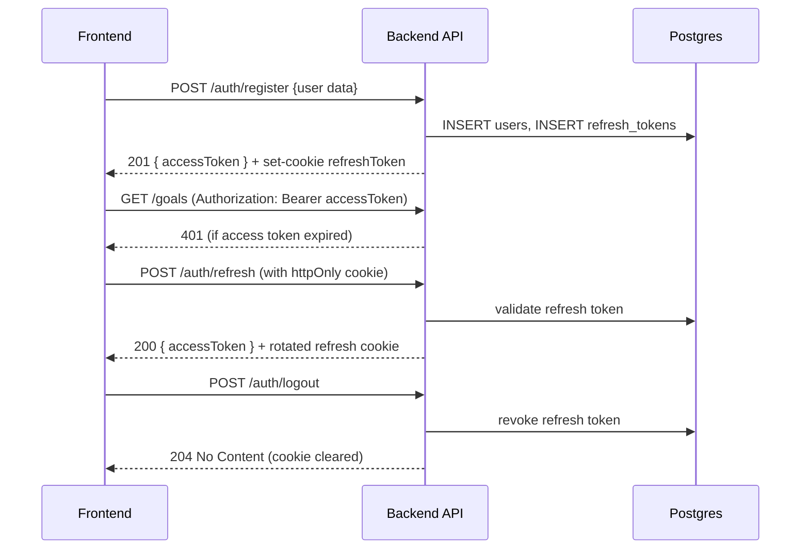

# Authentication Flow (SkillWise)

This document describes the authentication flow implemented in the backend and how the frontend integrates with it.

Overview
- Access tokens: short-lived JWTs returned in API responses and stored in frontend memory/localStorage for Authorization header usage.
- Refresh tokens: long-lived JWTs stored as httpOnly, secure cookies named `refreshToken`. These are not accessible via JavaScript.

Flow
1. Registration (/api/auth/register)
   - Frontend sends: { firstName, lastName, email, password, confirmPassword }
   - Backend: validates input, hashes password with `bcrypt`, stores user in Postgres `users` table, creates an access token and a refresh token.
   - Response: 201 JSON { status: 'success', data: { user, accessToken } } and sets `refreshToken` cookie (httpOnly).

2. Login (/api/auth/login)
   - Frontend sends: { email, password }
   - Backend: verifies password, issues access and refresh tokens, stores refresh token in `refresh_tokens` table, sets httpOnly cookie.
   - Response: 200 JSON { status: 'success', data: { user, accessToken } } and `refreshToken` cookie.

3. Using the API
   - Frontend attaches Authorization: Bearer <accessToken> to protected requests.
   - If a request returns 401, the frontend attempts to call `/api/auth/refresh` with `withCredentials: true` so the httpOnly refresh cookie is sent.

4. Refresh (/api/auth/refresh)
   - Backend verifies refresh token (from cookie or request body/header), ensures it's not revoked/expired, rotates it (generates new refresh token and updates DB), and returns a new access token.
   - Response: 200 JSON { status: 'success', data: { user, accessToken } } and a rotated `refreshToken` cookie.

5. Logout (/api/auth/logout)
   - Frontend calls `/api/auth/logout` which will revoke the refresh token server-side and clear the cookie.
   - Frontend also clears local access token state.

Security notes
- Refresh tokens are stored server-side in `refresh_tokens` table and are set as httpOnly cookies to mitigate XSS.
- Access tokens are short-lived JWTs; the frontend stores them in localStorage (or memory) and refreshes when needed.
- All sensitive secrets (JWT_SECRET, JWT_REFRESH_SECRET, DATABASE_URL) should be kept in environment variables (see `.env.example`).

Diagrams
Mermaid sequence diagram:

If you need a PNG/SVG diagram for the README, I can render the mermaid diagram and add the asset.
