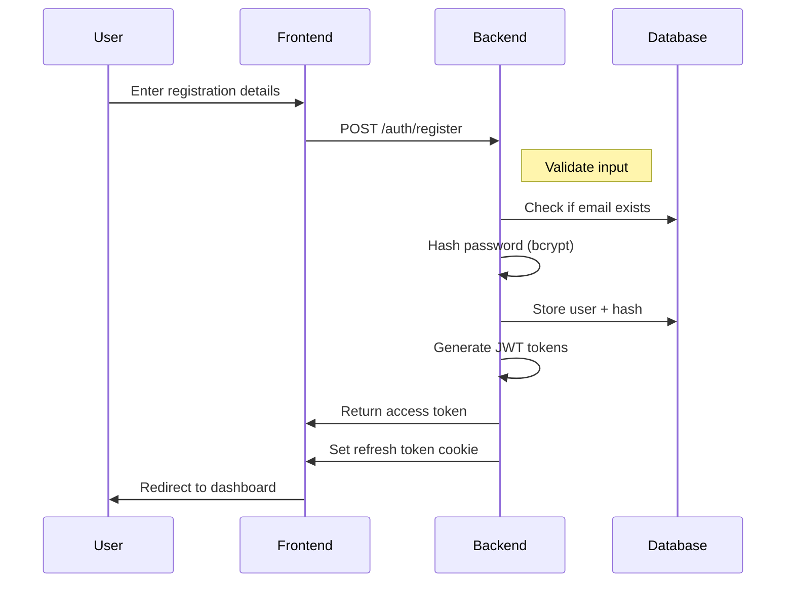
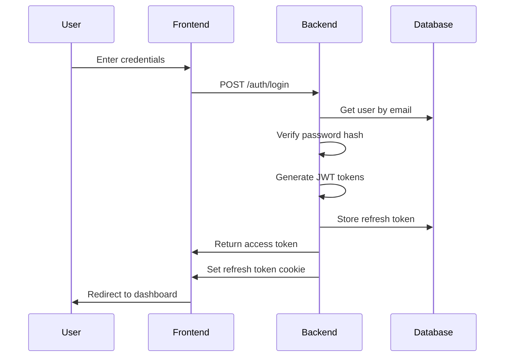
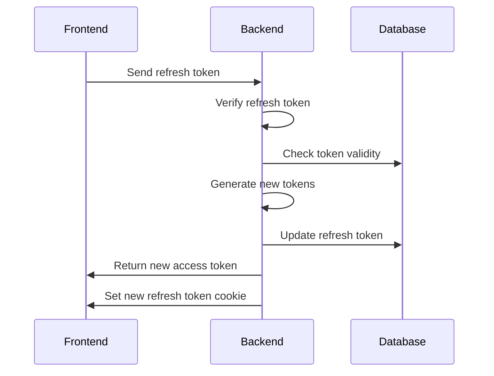
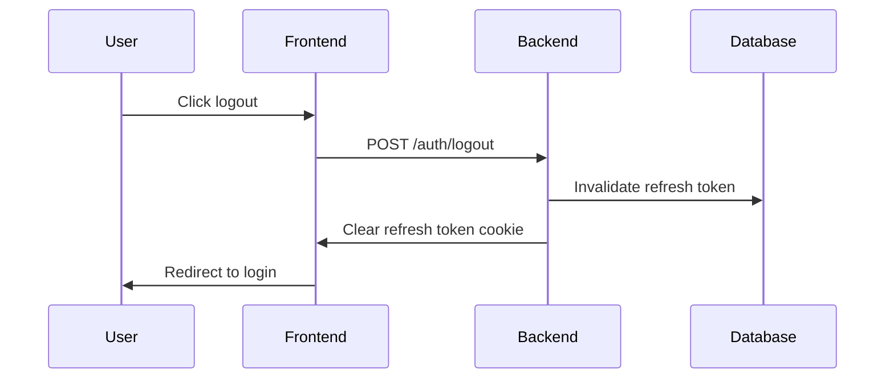

# Authentication Flow

## Overview

SkillWise implements a secure JWT-based authentication system with access and refresh tokens. This document outlines the complete authentication flows and security measures.

## Authentication Flows

### 1. Registration Flow



### 2. Login Flow



### 3. Token Refresh Flow



### 4. Logout Flow



## Security Measures

### Token Management

- Access tokens expire after 15 minutes
- Refresh tokens expire after 7 days
- HTTP-only secure cookies for refresh tokens
- Token rotation on refresh
- Token reuse detection

### Password Security

- Bcrypt hashing with 10 rounds
- Minimum 8 characters
- Requires lowercase, uppercase, number, special char
- Maximum length 128 characters

### Cookie Security

- HTTP-only flag
- Secure flag in production
- Strict SameSite policy
- 7-day expiration

### Error Handling

- Generic error messages (no info leaking)
- Rate limiting on auth endpoints
- Automatic token cleanup
- Session invalidation on security events

## API Endpoints

### POST /auth/register

```typescript
Request:
{
    email: string,
    password: string,
    fullName: string
}

Response:
{
    success: true,
    data: {
        user: {
            id: string,
            email: string,
            fullName: string
        },
        accessToken: string
    }
}
```

### POST /auth/login

```typescript
Request:
{
    email: string,
    password: string
}

Response:
{
    success: true,
    data: {
        user: {
            id: string,
            email: string,
            fullName: string
        },
        accessToken: string
    }
}
```

### POST /auth/refresh

```typescript
Request:
// Refresh token sent in HTTP-only cookie

Response:
{
    success: true,
    data: {
        accessToken: string
    }
}
```

### POST /auth/logout

```typescript
Request:
// No body required, uses token from cookie

Response:
{
    success: true,
    message: "Logged out successfully"
}
```

## Implementation Details

### Token Storage

- Access token: Memory only (never stored)
- Refresh token: HTTP-only cookie
- Token records: Database with revocation status

### Database Schema

```sql
-- Users table
CREATE TABLE users (
    id UUID PRIMARY KEY,
    email VARCHAR(255) UNIQUE NOT NULL,
    password_hash VARCHAR(255) NOT NULL,
    full_name VARCHAR(255) NOT NULL,
    created_at TIMESTAMP DEFAULT CURRENT_TIMESTAMP
);

-- Refresh tokens table
CREATE TABLE refresh_tokens (
    id UUID PRIMARY KEY,
    user_id UUID REFERENCES users(id),
    token TEXT NOT NULL,
    created_at TIMESTAMP DEFAULT CURRENT_TIMESTAMP,
    revoked BOOLEAN DEFAULT FALSE
);
```

### Security Headers

```http
Set-Cookie: refreshToken=<token>; HttpOnly; Secure; SameSite=Strict
Access-Control-Allow-Credentials: true
Access-Control-Allow-Origin: https://skillwise.com
Content-Security-Policy: default-src 'self'
X-Frame-Options: DENY
X-XSS-Protection: 1; mode=block
```

## Best Practices Implemented

1. **Token Security**

   - Short-lived access tokens
   - Secure token storage
   - Token rotation
   - Reuse detection

2. **Password Security**

   - Strong hashing (bcrypt)
   - Complex password requirements
   - Secure password reset flow

3. **Cookie Security**

   - HTTP-only cookies
   - Secure flag
   - SameSite policy
   - Domain restrictions

4. **Error Handling**

   - Generic error messages
   - Rate limiting
   - Brute force protection
   - Input validation

5. **Session Management**
   - Secure session handling
   - Token invalidation
   - Session timeout
   - Concurrent session control
